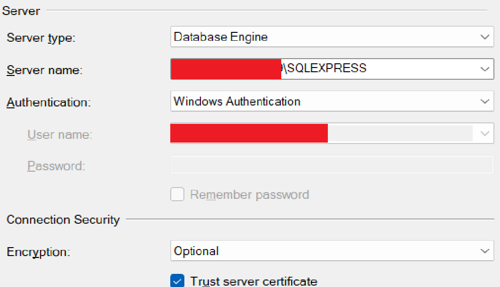

# Misfits OPMS

An order processing/point-of-sale management system for a certain thrift shop.

This system allows for the following:
- [x] Glance (Dashboard)
- [x] Manage Inventory
- [x] Manage Sale Transactions
- [x] Manage Customers and Suppliers
- [x] Manage Supply Orders
- [x] An Interface for Transaction
- [x] Intuitive Interface
- [x] Error Handling and Feedback
- [x] Search and Sorting Feature

## Setup Guide

> [!IMPORTANT]
> Tools and dependencies' versions listed below are the ones used whilst developing the system. Lower versions might work but it would be best to follow what the environment use for development.

### Tools
- Java JDK 21 +
- Code Editor or IDE (Ideally VSCode)
- SQL Server 22 +
- SQL Server Manager (SSMS or Microsoft Azure)

> [!NOTE]
> If you are using Java JDK 24, use other IDEs besides Netbeans as there is still compatibility issues with the Java version and the IDE. If you do not want to use other IDEs, alternatively, downgrade the version of your Java. As for Eclipse IDE, Java 24 is compatible through the installation of Java 24 Support (available in-app)

### Dependencies
- FlatLaf 3.5.4
- FlatLaf Inter Font 4.1
- FlatLaf Extras 3.5.4
- MigLayout Swing 11.4.2
- Microsoft SQLServer JDBC 12.10.0
- XChart 3.8.8
- Apache POI 5.4.1
- Apache POI OOXML 5.4.1

> [!NOTE]
> This project uses Maven for managing dependencies. To change versions of the dependencies, go to the pom.xml and replace the `<version></version>` of each dependency.
>
> If you do not have the same Java 21, replace both of the `<maven.compiler>` properties with your Java version

### Database Configuration

Assuming the tools above are already installed in your system, open up your SQL Server Manager (SSMS or Microsoft Azure) and **`create a database named Misfits`**. By default, we use **`SQLEXPRESS`** for the instance name, **`Windows Authentication`** for authentication, **`Optional`** for encryption, and **`Enabled`** trust server certificate.

After creating, we want to set up our newly created database and fill it with objects and records. Files to easily do this process are available inside the source code in the **[src/database](src/database/)** directory. Run the sql files in this order:

1. creation.sql
2. insertion.sql
3. obj.sql

Notice that there is a `DLL` file along with the SQL files in the directory. We use this to establish a connection between the program and the database. Download the file and put it inside the your Java PATH. **DO NOT** rename the file no matter what.

> [!NOTE]
> To check for your Java PATH, search `Edit system environment variables` in your windows search and click Environment Variables. Under the `System variables` or `User variables`, look for the variable `JAVA_HOME`. If not present, double click on the Path variable under `User variables` and look for a directory associated with Java

After putting the file inside the PATH, navigate to **[Connect.java](src/main/java/app/db/Connect.java)** and put your own credentials.

By default, you don't need to change anything with the credentials with the exception of **`encrypted`** and **`trustCert`** (depending on your server set up). If you have different values, replace the default ones with yours.

Once all of that is finished, we now have set up the database and the connection between it and the program and are now ready to use the system.

## Tips when Using

As soon as you run the program, you will be greeted by the Glance page, or in general terms, the Dashboard. The `Line Graph` is interactive as you can zoom in specific ranges for a granular view of sales of a date by dragging the cursor on the graph and resettable by double clicking or clicking the `Reset Zoom` button at the top center part of the graph. It is also exportable, which also applies to the `Doughnut Graph`.

The search function of the system is more of a filter than a traditional search. It allows users to search for results through "tags" wherein users can supply the value they want to search for. To reset the search, simply do a blank search (search without anything in the address bar).
